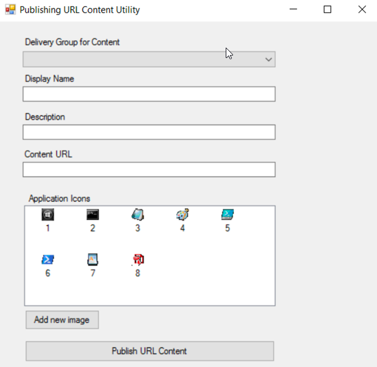

# Citrix Content Publishing Utility

The purpose of this utility is to help Citrix administrators publish "content" or URLs into your Citrix XenApp/XenDesktop environments using a GUI based tool. While the ability to publish content is available already, it currently only exists from the Powershell cmdlets. This tool is currently
built to be used on a XenApp/XenDesktop server or as a published application.

## Usage

1. DeliveryGroup - Select the delivery group where you would like to URL published to.

2. Display Name - Type in the display name for the published URL. This is what the your users will see.

3. Description - Description of the URL that you are publishing to your users

4. Application Icon - This is the icon you would like associated with the URL you publish. This icon will be displayed to the user either within Storefront or Receiver

    - If an image doesn't already exist you can use the"Add new image" button to add a new image to the list.

Once you have filled in all the fields, in order to publish your content URL to you will need to hit the "Publish URL content" button.

## Code

### Prerequisites

[Visual Studio](http://www.visualstudio.com) Community edition should be just fine for this project

[Windows](https://www.microsoft.com/en-us/windows/get-windows-10)

[Citrix XenApp/XenDesktop](https://www.citrix.com/community/citrix-developer/)

### Cloning the repo
    git clone https://github.com/citrix/PublishURLContent.git
